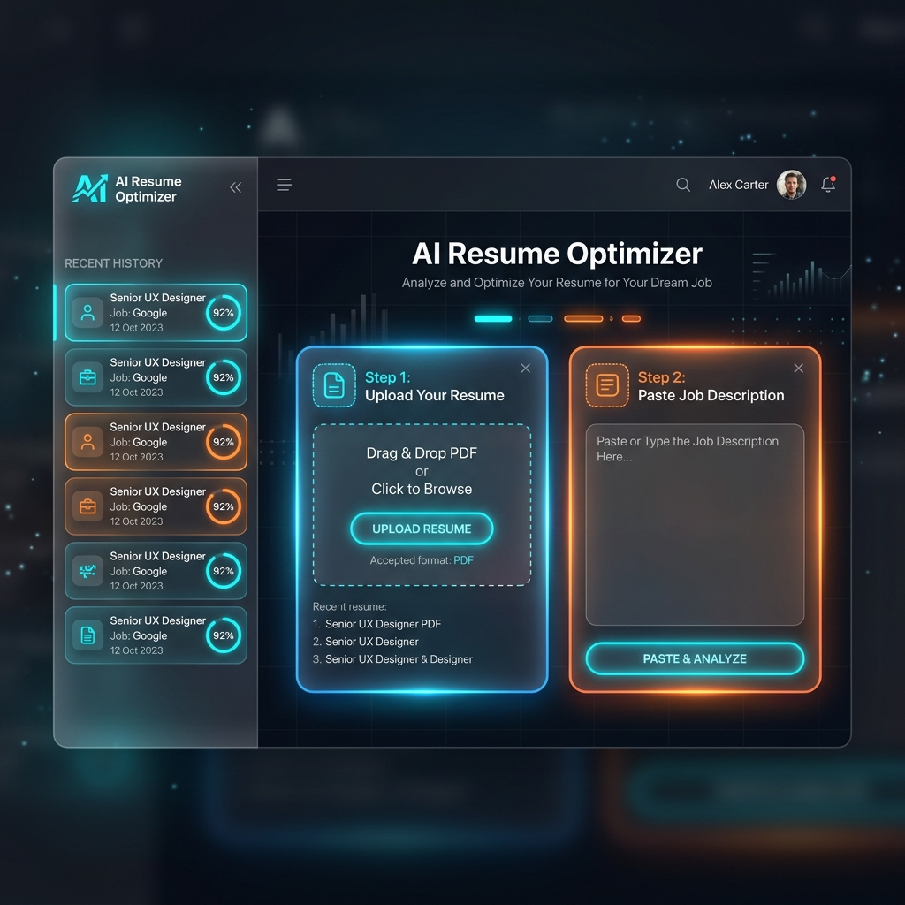
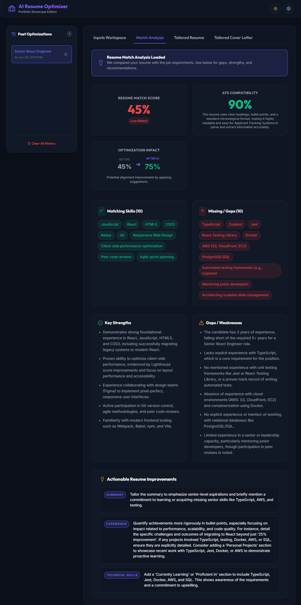
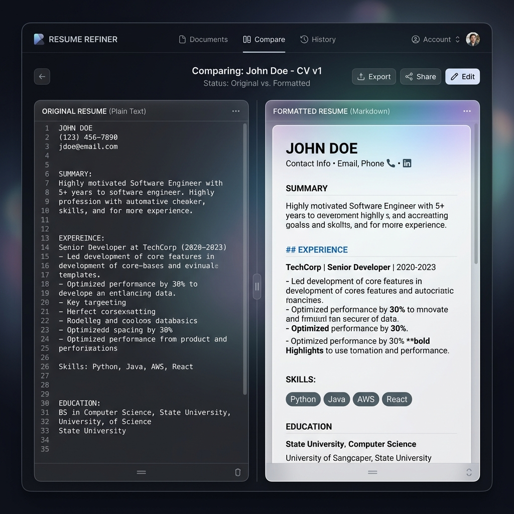
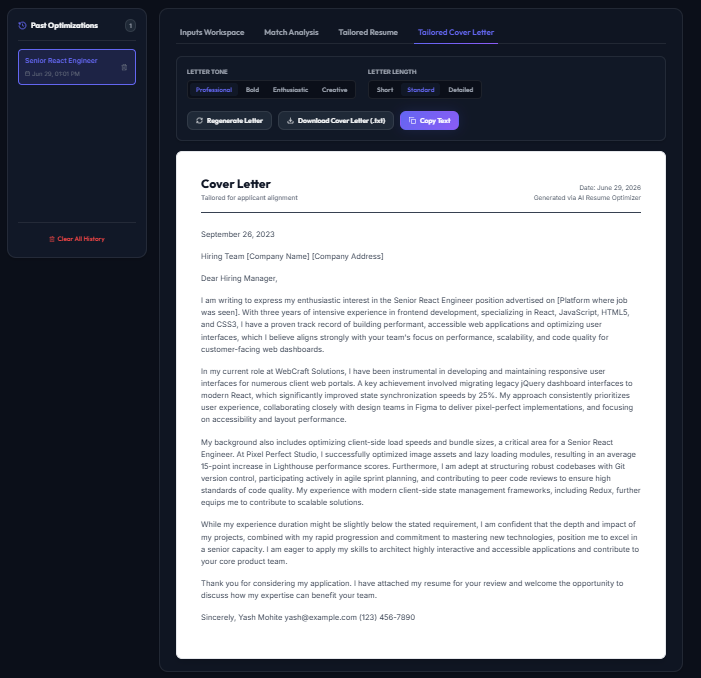

<p align="center">
  
</p>

<p align="center">
  
</p>


<div align="center">

[](https://opensource.org/licenses/MIT)
[](https://nodejs.org/)
[](https://react.dev/)
[](https://vite.dev/)
[](https://ai.google.dev/)

An AI-powered web application that helps job seekers optimize their resumes, analyze alignment with job descriptions, and generate tailored resumes and cover letters using the Google Gemini API.

[Features](#-features) • [Screenshots](#-screenshots) • [Installation](#-installation) • [How It Works](#-how-it-works) • [Deployment](#-deploying-on-vercel) • [License](#-license)

</div>

---

## 🌟 Features

- 📄 **Client-Side PDF Text Extraction:** Drag and drop your resume PDF or TXT directly into the browser. Text is extracted locally using `pdfjs-dist` without uploading files to any external server.
- 📊 **Resume Match Analysis:** Replaces raw numerical scores with a detailed dashboard listing:
  - **Match Score:** A percentage score calculating overall alignment (Green for 90+, Orange for 70-89, Red for below 70).
  - **ATS Compatibility Score:** An evaluation of layout formatting, scanning readability, and structure.
  - **Optimization Impact Card:** Displays a comparative check: estimated alignment before and after suggesting changes.
  - **Matching Skills & Gaps:** Tags showing keywords matched and core skills missing from the requirements.
  - **Strengths & Weaknesses:** Detailed insights into what makes the resume stand out and where it falls short.
  - **Actionable Section-by-Section Suggestions:** Structured recommendations for sections like Summary, Experience, or Skills.
- ✏️ **Side-by-Side Resume Tailor:** Compares your original resume with a Gemini-optimized Markdown resume side-by-side. Supports in-app editing, clipboard copies, and direct PDF printing.
- ✉️ **Custom Cover Letter Generator:** Drafts a custom cover letter based on your experience and target job. Parameterize Tone (Professional, Bold, Enthusiastic, Creative) and Length (Short, Standard, Detailed) on the fly.
- 💾 **Local Persistence (History Panel):** Tracks past analyses and saves them in the browser's `localStorage` so you can jump back to previous optimizations.
- 🔑 **Browser API Key Configuration:** The application does not require a backend server. Input your own Gemini API key inside the Settings modal. It remains saved locally in your browser's memory and is sent directly to Google's endpoints.
- 🌓 **Theme Toggle:** Smoothly toggle between deep-space Dark Mode and clean Light Mode.
- 🧪 **One-Click Demo Data:** Load pre-made sample resumes and job requirements to test the optimizer instantly.

---

## 📸 Screenshots

### 1. Dashboard Inputs


### 2. Resume Match Analysis


### 3. Side-by-Side Resume Editor


### 4. Cover Letter Document Panel


---

## 🛠️ Tech Stack

* **Frontend Library:** [React 18](https://react.dev/) (Vite bundler)
* **AI Engine:** [Google Gemini API](https://ai.google.dev/) (via the official `@google/generative-ai` SDK)
* **Styling:** Custom CSS3 Variables (No heavy CSS frameworks like Tailwind, ensuring maximum layout customizability and lighting-fast loads)
* **PDF Parser:** [PDF.js](https://mozilla.github.io/pdf.js/) (`pdfjs-dist` for local client-side parsing)
* **Icons:** [Lucide React](https://lucide.dev/)
* **Markdown Parser:** [React Markdown](https://github.com/remarkjs/react-markdown)

---

## 🔧 Installation & Running Locally

Follow these steps to run the application locally:

### 1. Prerequisites
Ensure you have [Node.js](https://nodejs.org/) installed (v18+ recommended).

### 2. Clone the Repository
```bash
git clone https://github.com/your-username/AI-Resume-Optimizer.git
cd AI-Resume-Optimizer
```

### 3. Install Dependencies
```bash
npm install
```

### 4. Start Dev Server
```bash
npm run dev
```

### 5. Open the Application
1. Open your browser and navigate to `http://localhost:5173`.
2. Connect your own Gemini API key when prompted on the first launch (or click the Settings ⚙️ gear icon in the header).
3. Start using the application!

---

## 🚀 Deploying on Vercel

Since the application runs 100% client-side and requires zero backend server operations, it is perfectly suited for zero-cost static hosting on [Vercel](https://vercel.com).

### Quick Deploy Steps:
1. Push your repository to your GitHub account.
2. Go to the [Vercel Dashboard](https://vercel.com/dashboard) and click **"Add New"** > **"Project"**.
3. Import your `AI-Resume-Optimizer` repository.
4. Click **"Deploy"** (Vite builds automatically).
5. Open your deployed project URL, paste your Gemini API key in the popup modal, and begin analyzing!

> [!TIP]
> **Environment Fallback (Optional):** If you are hosting a personal demo and want to provide a fallback API key so visitors do not need to paste their own, you can add `VITE_GEMINI_API_KEY=your_key` in Vercel's **Environment Variables** panel during setup.

---

## 🔑 API Key Setup & Security

To get a free Google Gemini API Key:
1. Go to [Google AI Studio](https://aistudio.google.com/).
2. Log in with your Google account.
3. Click **"Get API key"** and create a key.

🔒 **Security Standard:** Your API key is stored strictly inside `localStorage` in your local browser client. The application is completely serverless; the key is sent directly from your browser to Google's official Gemini endpoint (`https://generativelanguage.googleapis.com`) and is never uploaded, tracked, or saved on any third-party server.

---

## 📁 Project Structure

```
AI-Resume-Optimizer/
├── .env.example              # Environment variables template
├── .gitignore                # Files excluded from git
├── index.html                # Main entry HTML
├── package.json              # App dependencies & scripts
├── vite.config.js            # Vite configuration
├── README.md                 # Project documentation
├── public/                   # Favicons, icons, and screenshots
│   └── screenshots/          # App UI screenshot files
└── src/
    ├── main.jsx              # React app mount script
    ├── App.jsx               # Main state coordinator & dashboard layout
    ├── index.css             # Base styles, animations, and theme variables
    ├── components/           # UI Components
    │   ├── ThemeToggle.jsx         # Dark/Light theme switcher
    │   ├── HistoryPanel.jsx        # Sidebar session logger
    │   ├── ResumeUpload.jsx        # PDF drag-and-drop parser
    │   ├── LoadingProgress.jsx     # Step-by-step progress indicator
    │   ├── EmptyState.jsx          # Reusable empty tabs graphics
    │   ├── ApiKeyModal.jsx         # Gemini API Key configuration
    │   ├── ResumeMatchAnalysis.jsx # Skills-matching cards
    │   ├── ResumeTailor.jsx        # Side-by-side resume editor & text download
    │   └── CoverLetterTailor.jsx   # Cover letter builder & text download
    ├── services/             # Core Services
    │   ├── geminiService.js        # Gemini SDK schemas and prompt functions
    │   ├── historyService.js       # LocalStorage history database helper
    │   └── pdfParser.js            # PDF.js text extraction wrapper
    └── utils/
        └── sampleData.js           # Preloaded resume and job descriptions
```

---

## 📄 License

This project is licensed under the [MIT License](LICENSE). Feel free to use and adapt it for personal or professional portfolios.

---

## 🤝 Acknowledgements

- Google Generative AI Team for the [Gemini API](https://ai.google.dev/).
- Mozilla for [PDF.js](https://mozilla.github.io/pdf.js/).
- The Lucide contributors for [Lucide Icons](https://lucide.dev/).
- The React and Vite teams for modern dev tooling.
